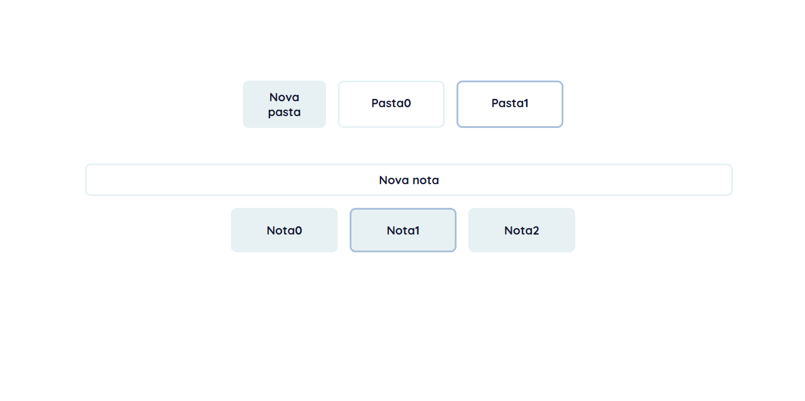

# Notes
Por: Angelus Trindade



Um site de lembretes onde eu estudo manuseamento de estado com javascript puro.

## Instalando 

Para executar o projeto, baixe o zip e abra o arquivo 'index.html'.

## Projeto
O app consiste de uma parte reservada as pastas e abaixo as notas.

No 'index.js' as funções de entrada são: 

``` {javascript}
  navAddbutton.addEventListener('click', onFolderFunc)
  mainAddbutton.addEventListener('click', () => onArticleFunc({item: null, isStateChanging: true}))
```

Disponíveis ao final do arquivo.

### 🤖 Tecnologias usadas: 
HTML, CSS, SCSS, Javascript